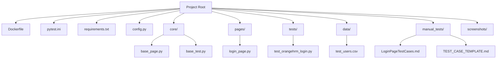

# Python Playwright Test Automation Framework


## Project Overview
This framework uses Playwright and Pytest for end-to-end testing of the OrangeHRM login page. It supports data-driven testing, robust reporting, Dockerization, CI/CD, and easy extensibility.

---

## Project Structure



- **core/**: Generic, reusable base classes and utilities
- **pages/**: App-specific page objects (inherit from BasePage)
- **tests/**: App-specific test classes (inherit from BaseTest)
- **Dockerfile**: Containerizes the test environment
- **pytest.ini**: Pytest configuration and custom markers
- **requirements.txt**: Python dependencies
- **config.py**: Centralized configuration (env vars, URLs, credentials)
- **pages/**: Page Object Model classes
- **tests/**: All test scripts
- **data/**: Test data files (CSV, etc.)
- **manual_tests/**: Manual test documentation and templates
- **screenshots/**: Failure screenshots

---

## How to Extend/Reuse for Any Web App

### 1. Add a New Page Object
- Create a new file in `pages/`, e.g. `my_page.py`:
  ```python
  from core.base_page import BasePage
  from playwright.sync_api import Page

  class MyPage(BasePage):
      def __init__(self, page: Page):
          super().__init__(page)
          self.some_selector = 'input[name="something"]'

      def do_something(self, value):
          self.fill(self.some_selector, value)
          self.click('button[type="submit"]')
  ```
- Use only selectors and app-specific actions in this class.

### 2. Add a New Test Class
- Create a new file in `tests/`, e.g. `test_my_feature.py`:
  ```python
  import pytest
  from pages.my_page import MyPage
  from core.base_test import BaseTest

  @pytest.mark.usefixtures("setup_page")
  class TestMyFeature(BaseTest):
      def setup_method(self, method):
          self.my_page = MyPage(self.page)
          self.page.goto("https://example.com")

      def test_feature(self):
          self.my_page.do_something("test")
          assert "expected" in self.page.content()
  ```
- All tests use `self.page` and page objects for actions/assertions.

### 3. Add/Update Test Data
- Place CSV, JSON, or other data files in `data/`.
- Use generic data loader utilities or Python's built-in modules.

### 4. Update Config
- Add new URLs, credentials, or environment variables in `config.py` or `.env`.

### 5. Run Your Tests
- Use the same commands as before (see below).

---

## Setup and Installation Instructions

1. **Clone the repository**
   ```sh
   git clone <your-repo-url>
   cd PythonFramework
   ```
2. **Install dependencies**
   ```sh
   pip install -r requirements.txt
   playwright install --with-deps
   ```
3. **(Optional) Set environment variables**
   - Create a `.env` file or set variables in your shell for credentials/URLs.
   - Example `.env`:
     ```env
     ORANGEHRM_URL=https://opensource-demo.orangehrmlive.com/web/index.php/auth/login
     VALID_USERNAME=Admin
     VALID_PASSWORD=admin123
     ```
4. **(Optional) Run in Docker**
   ```sh
   docker build -t orangehrm-tests .
   docker run --rm orangehrm-tests
   ```

---

## How to Run Tests

- **Run all tests:**
  ```sh
  pytest --headed --browser chromium --disable-warnings -v
  ```
- **Run a specific test file:**
  ```sh
  pytest tests/test_orangehrm_login.py
  ```
- **Run a specific test function:**
  ```sh
  pytest -k test_login_success
  ```
- **Run tests with a specific marker/tag:**
  ```sh
  pytest -m mcp
  ```
  - Markers are defined in `pytest.ini` (e.g., `mcp` for OrangeHRM login tests).
  - To add a marker to a test, use `@pytest.mark.mcp` above the test function.

---

## Parallel Execution and Rerun Instructions

- **Install required plugins:**
  ```sh
  pip install pytest-xdist pytest-rerunfailures
  ```
- **Run tests in parallel:**
  ```sh
  pytest -n auto
  ```
  - `-n auto` will use all available CPU cores.
- **Rerun failed tests automatically:**
  ```sh
  pytest --reruns 2
  ```
  - This will rerun failed tests up to 2 times.

---

## How to Generate Reports

- **Install reporting plugins:**
  ```sh
  pip install pytest-html allure-pytest
  ```
- **Generate an HTML report:**
  ```sh
  pytest --html=report.html --self-contained-html
  ```
  - Open `report.html` in your browser to view the results.
- **Generate an Allure report:**
  ```sh
  pytest --alluredir=allure-results
  allure serve allure-results
  ```
  - Requires [Allure CLI](https://docs.qameta.io/allure/#_installing_a_commandline)

---

## Tagging/Marker Basics
- Use `@pytest.mark.mcp` to tag OrangeHRM login tests.
- Add new markers in `pytest.ini` as needed:
  ```ini
  [pytest]
  markers =
      mcp: OrangeHRM login tests
      smoke: Smoke tests
      regression: Regression tests
  ```
- Run tests by marker:
  ```sh
  pytest -m smoke
  ```

---

## Data-Driven Testing Info
- Test data is maintained in `data/test_users.csv`.
- Add new rows to cover more scenarios without changing code.
- Example CSV row:
  ```csv
  username,password,expected
  invalid_user,admin123,Invalid credentials
  ```

---

## Manual Test Documentation References
- See `manual_tests/LoginPageTestCases.md` for mapped manual test cases.
- Use `manual_tests/TEST_CASE_TEMPLATE.md` for new manual test documentation.

---

## Troubleshooting Tips
- **Screenshots** of failures are saved in the `screenshots/` folder.
- Ensure Playwright browsers are installed: `playwright install --with-deps`
- For Docker, ensure your host supports running browsers (or use headless mode).
- If you see import errors, check your `PYTHONPATH` or use `sys.path.insert` as in the test files.
- For flaky tests, increase timeouts or use explicit waits for elements.
- For Playwright/pytest issues, see [Playwright Python docs](https://playwright.dev/python/docs/intro) and [Pytest docs](https://docs.pytest.org/en/stable/).

---

## Customizing Browser and Test Settings
- **Change browser:** Use `--browser firefox` or `--browser webkit` with pytest.
- **Run headless:** Omit `--headed` or set `--headless` (if supported by your runner).
- **Change base URL:** Edit `.env` or `config.py`.
- **Change timeouts:** Adjust `timeout` values in your test code.

---

## CI/CD Integration Example (GitHub Actions)

Add this to `.github/workflows/python-app.yml`:
```yaml
name: Python Playwright Tests
on: [push, pull_request]
jobs:
  test:
    runs-on: ubuntu-latest
    steps:
      - uses: actions/checkout@v3
      - name: Set up Python
        uses: actions/setup-python@v4
        with:
          python-version: '3.11'
      - name: Install dependencies
        run: |
          python -m pip install --upgrade pip
          pip install -r requirements.txt
          python -m playwright install --with-deps
      - name: Run tests
        run: pytest --headed --browser chromium --disable-warnings -v
      - name: Upload HTML report
        if: always()
        uses: actions/upload-artifact@v3
        with:
          name: html-report
          path: report.html
```

---

## Useful Links
- [Playwright Python Documentation](https://playwright.dev/python/docs/intro)
- [Pytest Documentation](https://docs.pytest.org/en/stable/)
- [Allure Reporting](https://docs.qameta.io/allure/)
- [pytest-xdist (Parallel)](https://pypi.org/project/pytest-xdist/)
- [pytest-rerunfailures](https://pypi.org/project/pytest-rerunfailures/)
- [pytest-html](https://pypi.org/project/pytest-html/)

---

## Contribution and License Info
- Fork, branch, and submit PRs for new features or bug fixes.
- Add/extend tests and update documentation as needed.
- All contributions are welcome!

**License:** MIT 

## Linting & Formatting

- **Auto-format code:**
  ```sh
  black .
  ```
- **Check code quality:**
  ```sh
  pylint --fail-under=9.0 $(git ls-files '*.py')
  ```
- **Pre-commit hooks:**
  - Install pre-commit: `pip install pre-commit`
  - Set up hooks: `pre-commit install`
  - Hooks will auto-run on commit and block if lint/format fails.
- **CI/CD:**
  - The pipeline will run `black --check .` and `pylint --fail-under=9.0 ...` and fail builds on critical issues.

### **Toggling/Controlling Linting & Formatting**

- **Temporarily skip pre-commit hooks:**
  ```sh
  git commit --no-verify
  ```
  (This skips all pre-commit checks for that commit.)

- **Disable pylint for a specific file or block:**
  - At the top of a file:
    ```python
    # pylint: skip-file
    ```
  - For a specific line:
    ```python
    my_var = 42  # pylint: disable=invalid-name
    ```
  - For a code block:
    ```python
    # pylint: disable=too-many-locals
    def my_func(...):
        ...
    # pylint: enable=too-many-locals
    ```

- **Disable black formatting for a block:**
  ```python
  # fmt: off
  code_that_should_not_be_formatted()
  # fmt: on
  ```

- **Exclude files from lint/format checks:**
  - Add to `.pre-commit-config.yaml` under `exclude:` or use `--exclude` with black/pylint.
  - Example for black:
    ```yaml
    - id: black
      exclude: 'excluded_file.py'
    ```

- **CI/CD Toggle:**
  - You can add an environment variable (e.g., `SKIP_LINT=true`) and conditionally skip lint steps in your CI pipeline YAML if needed.

--- 